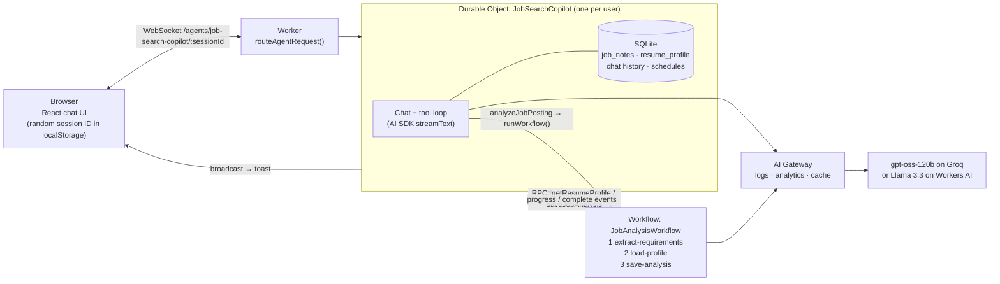

# Job Search Copilot

[](https://github.com/aravinthM172/Ai-Agent/actions/workflows/sanity-check.yml)

**Live demo:** https://job-search-copilot.aravinthm172.workers.dev

An AI agent on Cloudflare that tracks your job applications and tells you honestly how well you match a job. You chat with it in plain English:

- "Save my resume: backend engineer, 4 years, TypeScript, Node.js, PostgreSQL, AWS…"
- "Analyze this posting: _(paste a job description)_" → background analysis → **"Acme – Senior Backend Engineer: 65% match. Missing: Kubernetes."**
- "Save this job: Acme Corp, Backend Engineer, I just applied"
- "What jobs have I applied to?" / "I got an interview with Acme"
- "Remind me to follow up with Acme in 3 days"

Built for the Cloudflare AI application assignment on the [Agents SDK](https://developers.cloudflare.com/agents/).

## Assignment components

| Component                   | Implementation                                                                                                                                                                                                                      |
| --------------------------- | ----------------------------------------------------------------------------------------------------------------------------------------------------------------------------------------------------------------------------------- |
| **LLM**                     | **gpt-oss-120b on Groq** (`openai/gpt-oss-120b`) when `GROQ_API_KEY` is set, otherwise **Llama 3.3 70B on Workers AI** (`@cf/meta/llama-3.3-70b-instruct-fp8-fast`, routed through **AI Gateway**)                                  |
| **Workflow / coordination** | A **Durable Object** per user (`JobSearchCopilot`, Agents SDK) runs the chat and tool-calling loop; a **Cloudflare Workflow** (`JobAnalysisWorkflow`) runs durable multi-step job analysis; the Agents SDK scheduler runs reminders |
| **User input**              | **Chat** over WebSockets, from a React UI served by **Workers static assets**                                                                                                                                                       |
| **Memory / state**          | **SQLite inside each Durable Object**: jobs, match analyses, resume profile, chat history, and schedules, persisted across sessions and deploys                                                                                     |

## Architecture



**Request flow for "analyze this job posting":**

1. The browser sends the message over the agent's WebSocket. The Worker routes it to the user's own Durable Object by session ID.
2. The chat loop streams Llama 3.3's response. The model calls the `analyzeJobPosting` tool, which saves the job to SQLite and starts `JobAnalysisWorkflow`. The chat replies right away.
3. The Workflow runs in the background:
   - **extract-requirements:** Llama 3.3 in JSON mode returns the required and nice-to-have skills, minimum years of experience and seniority, validated with zod. Retried with exponential backoff (and cached for 24h by AI Gateway when running on Workers AI).
   - **load-profile:** reads the resume from the agent's SQLite over RPC.
   - **save-analysis:** computes a deterministic match score in code and writes it back.
4. The Workflow reports progress and completion to the agent, which broadcasts it to the browser as a toast: _"Acme – Senior Backend Engineer: 65% match. Missing: Kubernetes."_

## Design decisions

- **One Durable Object per user.** Each browser generates a random session ID and connects to its own agent instance, so every user gets an isolated, strongly consistent SQLite database with no shared tables or `WHERE user_id = ?` filters. It also scales horizontally, because each user's agent runs on its own. (The template's default connected everyone to one shared `default` instance; a test in `test/agent.test.ts` asserts isolation.)
- **A Workflow for analysis, not a longer chat turn.** The LLM extraction can fail transiently (rate limits, timeouts, malformed JSON). As a Workflow step it is retried with backoff, completed steps are never re-run, and the run survives restarts and deploys. The chat stays responsive, with results pushed to the browser when they're ready.
- **The LLM extracts; code scores.** Asking the model for a "match percentage" gives a different number every run. Here the model only extracts requirements (structured JSON, validated), and `src/lib/matching.ts` computes the score deterministically, handling aliases (`k8s` → Kubernetes), alternatives ("Go _or_ TypeScript") and negation ("_no_ Kubernetes experience" doesn't count as having it). Same input, same score, and fully unit-tested.
- **AI Gateway in front of Workers AI.** Every model call is logged and visible in one dashboard, and the extraction step is cached for 24h: re-analyzing the same posting costs no inference. Configured with one `gateway` option, so switching models or providers later doesn't touch the agent.
- **Groq for the model, Workers AI as the backup.** The Workers AI free tier (10,000 neurons/day) ran out after a few Llama 3.3 70B conversations. Groq's free tier has a higher allowance. Groq has retired Llama 3.3 70B, so the app uses `openai/gpt-oss-120b` there, its strongest open model for tool calling; the prompts and guardrails are unchanged and apply to both. `src/lib/llm.ts` picks the provider: Groq when the `GROQ_API_KEY` secret is set, Workers AI otherwise (local dev and tests need no key). Groq is called directly: this account's `default` AI Gateway requires Cloudflare authentication (error 2009 on the gateway's `groq` URL), so only Workers AI calls go through the gateway.
- **Friendly failures.** Model errors (Workers AI and Groq daily limits, rate limits, timeouts) are mapped to plain-English messages in the chat instead of the SDK's generic "An error occurred.", and raw errors are never shown to the user.

## Reliability work: bugs found in production and how they were fixed

Testing the deployed agent surfaced real issues. Each fix is documented in code comments and covered by tests.

| Problem observed                                                                               | Root cause                                                                                                                                                               | Fix                                                                                                                                                                           |
| ---------------------------------------------------------------------------------------------- | ------------------------------------------------------------------------------------------------------------------------------------------------------------------------ | ----------------------------------------------------------------------------------------------------------------------------------------------------------------------------- |
| Every tool call failed; tool arguments looked like `{"summary": "{"summary": "BackendBackend…` | Workers AI's Llama 3.3 stream now sends each delta **twice** per SSE chunk (`choices[0].delta` and legacy `response`/`tool_calls`); `workers-ai-provider` 3.x reads both | `fixWorkersAIBinding` wraps the AI binding and strips the legacy fields from the SSE stream (`src/lib/workers-ai.ts`)                                                         |
| The agent looped, calling tools 20× per message, and saved invented text as the user's resume  | Llama 3.3 repeats tool calls when tool results are JSON flags, and fills gaps with placeholder text                                                                      | Plain-English tool results; upsert instead of insert; grounding check on resume text; missing-input checks; after a repeated call a tool-free final step forces a text answer |
| Replies came back empty after the loop guard kicked in                                         | The provider sends `tools: []` for tool-less steps, which Workers AI rejects                                                                                             | The binding wrapper omits empty `tools`/`tool_choice`                                                                                                                         |
| Long answers cut off mid-sentence                                                              | Provider default of 256 output tokens                                                                                                                                    | `maxOutputTokens: 1024`                                                                                                                                                       |
| "An error occurred." with no explanation                                                       | Workers AI free tier daily limit (error 4006) hidden by the SDK                                                                                                          | `friendlyAIError` + an error banner in the UI                                                                                                                                 |

## Testing

```bash
npm test         # 36 tests, run inside the real Workers runtime (workerd)
npm run check    # formatting (oxfmt), lint (oxlint), types (tsc)
```

Tests use [`@cloudflare/vitest-pool-workers`](https://developers.cloudflare.com/workers/testing/vitest-integration/), so they run against real Durable Objects, SQLite, and the Workflows engine, not mocks of them:

- `test/agent.test.ts`: Durable Object storage (upserts, status updates, per-user isolation) and an **end-to-end Workflow run** with the LLM step mocked via `introspectWorkflowInstance` (extract → RPC → score → saved to SQLite).
- `test/matching.test.ts`: the scoring engine (aliases, negation, whole-word matching, `C++`/`C#`, experience penalty, determinism).
- `test/workers-ai.test.ts`: the SSE de-duplication (including chunks split mid-line), empty-tools handling, and error mapping.
- `test/guardrails.test.ts`: loop detection, made-up-resume detection (using the real strings Llama produced), and JSON-mode parsing.

No test calls Workers AI, so the suite is fast, free, and deterministic. CI (GitHub Actions) runs `check` and `test` on every push.

## Project structure

```
src/
  server.ts                  # JobSearchCopilot agent (Durable Object): SQLite schema, data access, chat tools, workflow callbacks
  workflows/job-analysis.ts  # JobAnalysisWorkflow: durable 3-step analysis
  lib/
    workers-ai.ts            # AI binding fixes, friendly error messages
    requirements.ts          # LLM requirement extraction (JSON mode + zod)
    matching.ts              # deterministic resume ↔ job scoring
    guardrails.ts            # loop / made-up-data guards for tool use
  app.tsx                    # React chat UI (per-browser session, toasts, error banner)
test/                        # Vitest suites (Workers runtime)
wrangler.jsonc               # bindings: Durable Object, Workflow, Workers AI, assets, AI Gateway id
```

## Running locally

```bash
npm install
npx wrangler login   # Workers AI has no local simulator; dev proxies AI calls to your account
npm run dev          # http://localhost:5173
```

Your Cloudflare account needs a `workers.dev` subdomain (Workers & Pages → onboarding in the dashboard), or remote dev mode fails with error 10063. Instead of `wrangler login`, you can set `CLOUDFLARE_API_TOKEN` in a `.env` file (see `.dev.vars.example`). No third-party API key is needed for dev: without `GROQ_API_KEY` the app uses Workers AI. To use Groq, create a free key at [console.groq.com/keys](https://console.groq.com/keys), put `GROQ_API_KEY=...` in `.dev.vars` for dev, and run `npx wrangler secret put GROQ_API_KEY` for production.

## Deploying

```bash
npm run deploy       # vite build && wrangler deploy
```

## Limitations and next steps

- **Identity is a bearer session ID.** Anyone with a browser's session ID could open that agent. It's unguessable (UUID v4), but real accounts would put [Cloudflare Access](https://developers.cloudflare.com/cloudflare-one/applications/) or OAuth in front and derive the agent name from the authenticated user.
- **Free-tier limits.** Groq's free tier caps gpt-oss-120b per minute and per day (tokens and requests), and Workers AI's free tier allows 10,000 neurons per day. AI Gateway caching helps; production would use a paid plan and AI Gateway rate limits per user.
- **Model reliability.** Llama 3.3's tool calling needed the guardrails above. The provider layer is swappable (the AI SDK plus AI Gateway), so a stronger tool-calling model could be dropped in.
- **Ideas:** fetch job postings from a URL with Browser Rendering, semantic skill matching with Vectorize embeddings instead of aliases, human-in-the-loop approval before saves (the UI already supports tool approvals), and an email agent that ingests job alerts.

## AI-assisted development

This project was built with AI assistance (Claude), starting from Cloudflare's official `cloudflare/agents-starter` template. The complete prompt history, including the debugging sessions above, is in [`PROMPTS.md`](./PROMPTS.md).
